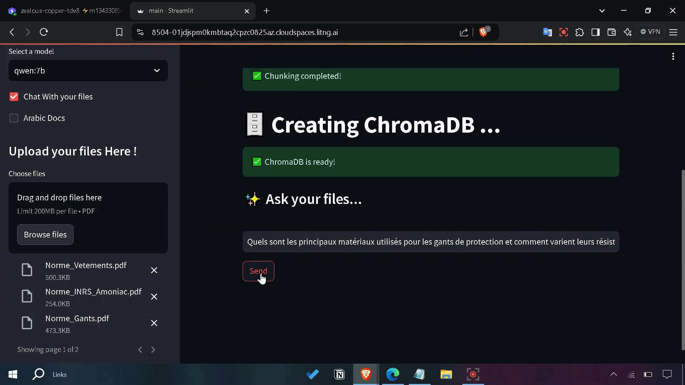
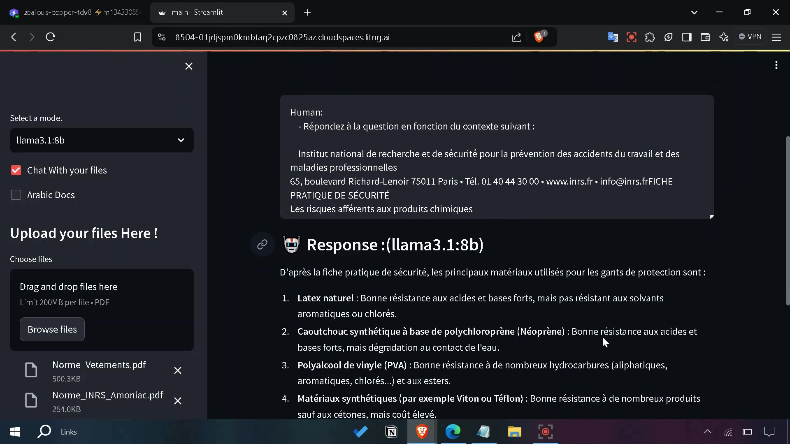
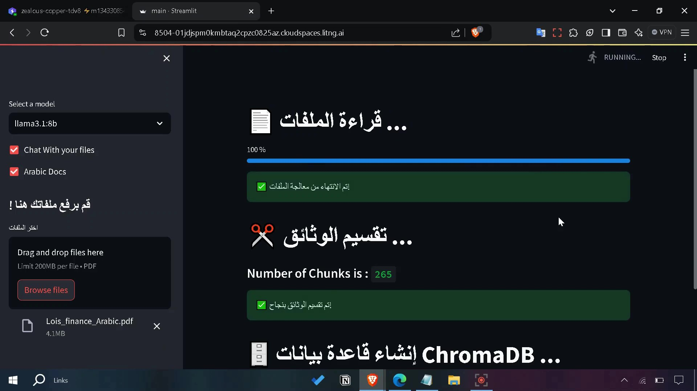
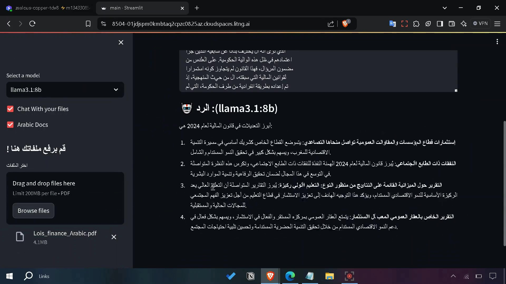

<div align="center">
  
</div>  

# RAGify  

**RAGify** is a Retrieval-Augmented Generation (RAG) application designed to enhance the way you interact with PDF documents. Powered by **Streamlit**, **LangChain**, **ChromaDB**, and local **LLMs via Ollama**, this app allows you to query PDF files intelligently in both **English** and **Arabic**.  

---

## 🚀 Key Features  

- **PDF Querying**: Upload PDFs and ask questions to extract insights quickly and accurately.  
- **Multilingual Support**: Seamless handling of both **English** and **Arabic** text for querying and responses.  
- **Local LLMs**: Ensures privacy by using local language models via **Ollama**—no external API required.  
- **Efficient Retrieval**: Employs **ChromaDB** for fast and accurate document embeddings and retrieval.  
- **Streamlit UI**: User-friendly interface for easy document interaction.  

---

## 📷 Screenshots  

<table>
  <tr>
    <td align="center">
      
    </td>
    <td align="center">
      
    </td>
  </tr>
</table>

<table>
  <tr>
    <td align="center">
      
    </td>
    <td align="center">
      
    </td>
  </tr>
</table>

---

## 🛠️ Installation  

### Clone the Repository  
```bash  
git clone https://github.com/ITSAIDI/RAGify.git  
cd RAGify
cd Code 
```  

### Install Dependencies

- Install first <a href="https://ollama.com/download">Ollama</a> server in your machine.
- In a new **cmd** run the commands bellow to install some models :

```bash  
ollama pull hf.co/nomic-ai/nomic-embed-text-v1.5-GGUF:F32 
ollama pull llama3.2:3b
ollama pull llama3.1:8b
ollama pull qwen:7b 
```
- Then in a new Conda env or venv install some python libraries with :

```bash  
pip install -r requirements.txt  
```  

### Start the Application  
```bash  
streamlit run main.py  
```  

---

## 📝 How to Use  

1. Upload a PDF file(s) via the Streamlit interface.  
2. Choose your query language (Arabic or other).  
3. Ask questions about the document.  
4. Get precise answers powered by the RAG pipeline.  

---

## 🌐 Technologies Used  

- **Streamlit**: Frontend interface for user interaction.  
- **LangChain**: Framework for building RAG pipelines.  
- **ChromaDB**: Vector database for document embeddings and retrieval.  
- **Ollama LLMs**: Local language model server for secure and private inference.
  
---

## 🤝 Contributing  

Contributions are welcome! Please fork the repository and submit a pull request.  

---

## 🌟 Acknowledgments  

Special thanks to the developers of Streamlit, LangChain, ChromaDB, and Ollama for their fantastic tools that made this app possible.  

---
